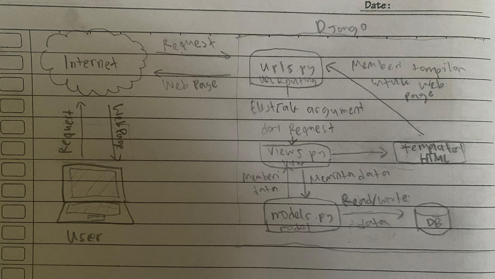
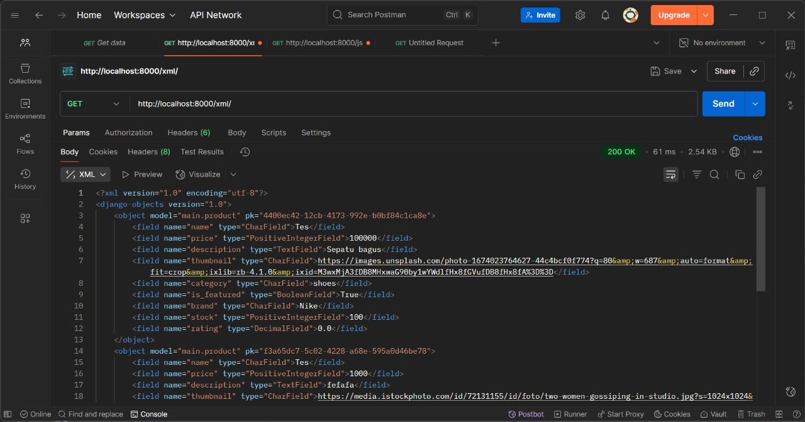
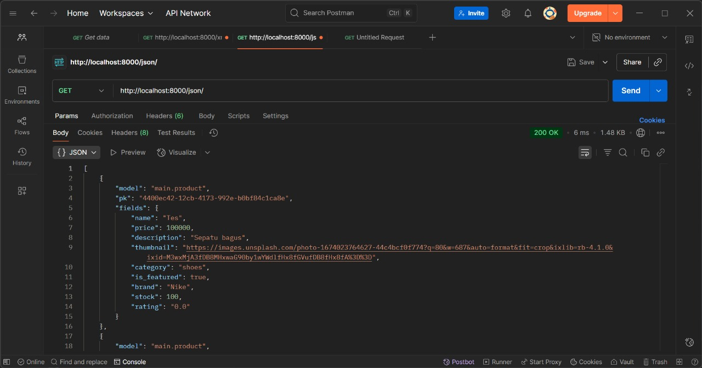
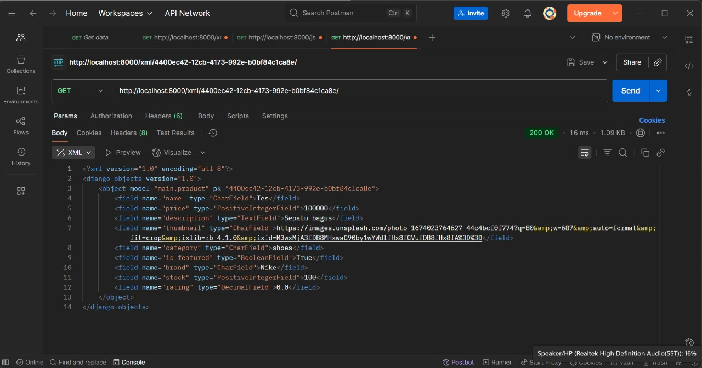
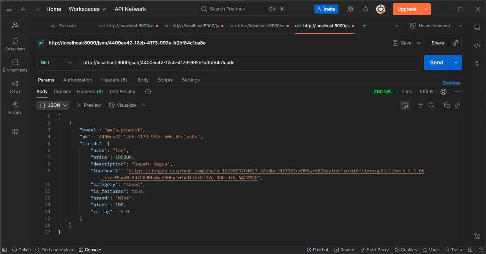

# FeetBalls
FeetBalls

### Author
- Name: Muhammad Nadhif Ibrahim
- NPM: 2406398324
- Class: PBP C

### Deployment
You can access the web here: [FeetBalls](https://muhammad-nadhif41-footballshop.pbp.cs.ui.ac.id/)

---

## Tugas Individu 2 - PBP Ganjil 2025/2026

### Jelaskan bagaimana cara kamu mengimplementasikan checklist di atas secara step-by-step (bukan hanya sekadar mengikuti tutorial).

1. **Membuat sebuah proyek Django baru.**
   - Buat direktori baru yaitu football-shop. Pastikan Python sudah terinstall (bisa cek dengan mengetik `python --version` di terminal). Lalu, install django dengan mengetik `pip install django` di terminal atau `pip install -r requirements.txt` di mana requirements.txt berisi django dan lain-lain. Terakhir, jalankan `django-admin startproject football-shop`

2. **Membuat aplikasi dengan nama main pada proyek tersebut.**
   - Ketik `python manage.py startapp main` di terminal dan aplikasi main akan terbuat.

3. **Melakukan *routing* pada proyek agar dapat menjalankan aplikasi main.**
   - Buka `settings.py`, tambahkan main di `INSTALLED_APPS`.

4. **Membuat model pada aplikasi main dengan nama Product.**
   - Buka models.py, tambahkan `class Product(models.Model):`, lalu isi dengan atribut wajib `name`, `price`, `description`, `thumbnail`, `category`, dan `is_featured`.

5. **Membuat sebuah fungsi pada views.py untuk dikembalikan ke dalam sebuah template HTML yang menampilkan nama aplikasi serta nama dan kelas.**
   - Import `from django.shortcuts import render`, buat fungsi yang menerima `request`, mengisi `context` yang berguna seperti "kamus" untuk aplikasi, dan me-return `render(request, file HTML, context)`.

6. **Membuat sebuah *routing pada urls.py aplikasi main untuk memetakan fungsi yang telah dibuat pada views.py.**
   - Buka `football-shop/urls.py`, tambahkan `from django.urls import path, include`, lalu di `urlspattern`; tambahkan `path('', include('main.urls'))`.

7. **Melakukan deployment ke PWS terhadap aplikasi yang sudah dibuat sehingga nantinya dapat diakses oleh teman-temanmu melalui Internet.**
   - Buat project baru di PWS. Set enviroment variables. Tambahkan URL deployment PWS di `ALLOWED_HOSTS` pada `settings.py`. Lalu push ke PWS dan gunakan credentials yang telah diterima.

8. **Membuat sebuah README.md yang berisi tautan menuju aplikasi PWS yang sudah di-deploy, serta jawaban dari beberapa pertanyaan berikut.**
   - Buat file `README.md` yang berisi tautan menuju aplikasi PWS dan menjawab beberapa pertanyaan.

### Buatlah bagan yang berisi request client ke web aplikasi berbasis Django beserta responnya dan jelaskan pada bagan tersebut kaitan antara urls.py, views.py, models.py, dan berkas html.
   

### Jelaskan peran settings.py dalam proyek Django!
 - `settings.py` bagaikan otak dari project tersebut. Ia mengatur identitas project (bahasa, zona waktu, dll), daftar aplikasi aktif (di `INSTALLED_APPS`), konfigurasi database, mengatur lokasi file statis dan file upload dari user, keamanan, dan lain-lain.

### Bagaimana cara kerja migrasi database di Django?
 - Migrasi adalah cara Django menerjemahkan perubahan pada `models.py` ke database. Alur kerjanya adalah mendefinisikan model di `models.py`. Lalu, jalankan `python manage.py makemigrations` di terminal, ini akan membuat file migrasi di folder migrations. Terakhir, jalankan `python manage.py migrate` di terminal sehingga tabel dari model akan terbentuk di database.

### Menurut Anda, dari semua framework yang ada, mengapa framework Django dijadikan permulaan pembelajaran pengembangan perangkat lunak?
 - Pertama, Django menggunakan bahasa pemrograman Python, di mana Python merupakan bahasa pemrograman yang mudah dipelajari oleh pemula karena bahasanya yang mendekati bahasa manusia. Kedua, dokumentasi dan komunitas yang bagus, di mana dokumentasi Django sangat lengkap dan banyak forum yang membahas Django. Ketiga, relevansi dunia nyata, di mana banyak industri besar yang menggunakan Django sebagai framework.

### Apakah ada feedback untuk asisten dosen tutorial 1 yang telah kamu kerjakan sebelumnya?
 - Tidak ada.

## Tugas Individu 3 - PBP Ganjil 2025/2026

### Menjawab beberapa pertanyaan berikut pada README.md pada root folder.

1. **Jelaskan mengapa kita memerlukan data delivery dalam pengimplementasian sebuah platform?**
 - Data delivery diperlukan dalam pengimplementasian sebuah platform agar semua modul dapat komunikasi dan bekerja sama. Data harus bisa dikirim dari satu bagian ke bagian lain. Misal, user isi form di web, data dikirim ke server, server proses, lalu kirim hasil ke user. Selain itu, data delivery yang aman dapat meningkatkan keamanan dan privasi, data delivery yang aman mencakup HTTPS, enkripsi, dan autentikasi. Data delivery yang baik juga dapat meningkatkan efisiensi dan perform, misalnya caching, compression, atau streaming.

2. **Menurutmu, mana yang lebih baik antara XML dan JSON? Mengapa JSON lebih populer dibandingkan XML?**
 - Menurut saya, JSON lebih baik dari XML. Alasannya adalah lebih readable, cocok dengan struktur data di banyak bahasa pemrograman, dan ringan (tidak banyak tag). JSON lebih populer dibandingkan XML karena beberapa alasan yang saya tulis tadi. Selain itu, JSON lebih populer karena ekosistem API modern sudah seragam memakai JSON. Semenjak mobile app & web API berkembang pesat, JSON menjadi standar di industri.

3. **Jelaskan fungsi dari method is_valid() pada form Django dan mengapa kita membutuhkan method tersebut?**
 - Kita membutuhkan method is_valid() pada form Django untuk memvalidasi form yang diisi. Jika sudah sesuai, maka form.is_valid() akan mengembalikan True dan objek tersimpan di data. Form yang tidak valid bisa jadi data kosong di field yang seharusnya diisi, tipe data yang tidak sesuai (string masuk ke field angka), bisa memicu bug atau vulnerability, dan lain-lain.

4. **Mengapa kita membutuhkan csrf_token saat membuat form di Django? Apa yang dapat terjadi jika kita tidak menambahkan csrf_token pada form Django? Bagaimana hal tersebut dapat dimanfaatkan oleh penyerang?**
 - CSRF token adalah token unik yang disisipkan Django ke setiap form HTML. Token ini terkirim saat user submit form. Seandainya token tersebut cocok dengan token yang disimpan di session user, request dianggap sah, seandainya tidak, request akan ditolak. Kita membutuhkan CSRF token untuk menghindari serangan CSRF (Cross-Site Request Forgery), di mana siapapun bisa membuat form palsu yang diam-diam mengirim request ke server atas nama user lain. 
 
 Anggap tidak ada CSRF token di website saya. Saya login sebagai admin dan browser menyimpan cookie session. Misal ada orang jahat yang membuat link dengan kode yang mengarah ke /create_product, dan mereka membuat produk palsu, lalu saya tidak sengaja klik link tersebut. Seandainya saya tidak memakai CSRF token dan browser membawa cookie session admin, server akan mengira itu request asli dari saya, sehingga produk masuk ke database. Seandainya ada CSRF token, hal itu tidak akan terjadi karena requestnya ditolak (token salah/tidak ada)

### Jelaskan bagaimana cara kamu mengimplementasikan checklist di atas secara step-by-step (bukan hanya sekadar mengikuti tutorial).**

1. **Membuat base.html sebagai template untuk file HTML lainnya yang akan kita buat.**

2. **Mengatur base.html untuk dijadikan sebagai template di settings.py bagian TEMPLATES di 'DIRS'.**

3. **Mengatur ulang file HTML yang lalu agar sesuai dengan template.**

4. **Membuat forms.py, lalu membuat fungsi baru di views.py, yaitu create_product dan show_product, di mana create_product berdasarkan dari forms.py.**

6. **Memasukkan path URL di variabel urlpatterns di urls.py di main.**

7. **Atur main.html agar dapat create dan show product.**

8. **Buat file HTML create_product dan show_product.**

9. **Atur CSRF_TRUSTED_ORIGINS di settings.py mengingat CSRF token akan digunakan dalam pengisian form.**

10. **Setelah form dibuat dan data bisa masuk, kita perlu data delivery untuk melihat data tersebut, bisa dalam bentuk XML atau JSON, di tugas ini kita menggunakan keduanya.**

11. **Atur views.py dengan mengimport HttpResponse dan Serializer.**

12. **Kita akan membuat fungsi show_xml dan show_json, di mana kita akan mengambil semua objek dari produk dan diserialisasi menjadi XML dan JSON, lalu kita akan mereturn HttpResponse yang berisi parameter data hasil query yang sudah diserialisasi dan parameter content_type="application/xml" atau "application/json.**

13. **Jangan lupa untuk mengimport 2 fungsi tersebut di urls.py di main dan menambahkan path url ke dalam urlspattern,  path('xml/', show_xml, name='show_xml'), dan seterusnya.**

14. **Untuk fungsi XML by ID dan JSON by ID, kita dapat mengikuti langkah seperti sebelumnya, tetapi kita akan menambah parameternya yaitu dengan ID dari objek tersebut.**

15. **Untuk XML by ID, kita akan mengambil objek menggunakan filter(), sedangkan JSON by ID menggunakan get(). Kita akan mereturn HttpResponse yang berisi parameter data hasil query yang sudah diserialisasi dan parameter content type yang sama seperti sebelumnya.**

16. **Kita juga akan menambahkan try except seandainya ID dari objek tersebut tidak ditemuka di database, sehingga akan mengembalikan HttpResponse dengan status 404.**

17. **Jangan lupa untuk menambahkan path URL di URL pattern.**

- **Kesimpulan:**
   - **Untuk menambahkan 4 fungsi views baru (xml, json, xml by id, json by id), import HttpsResponse dan serializer. Parameter untuk xml dan json adalah request sedangkan xml by id dan json by id adalah request dan id. Ambil semua objek untuk xml dan json, ambil objek menggunakan filter() untuk xml by id dan get() untuk json by id.**
   - **Untuk membuat routing URL, import fungsi-fungsi tersebut di urls.py di main, isi urlspattern dengan path yang sesuai dengan parameternya**
   - **Untuk membuat halaman yang menampilkan data objek model yang memiliki tombol "Add" yang akan redirect ke halaman form, kita dapat membuat forms.py yang berisi tipe form yang ingin kita buat (alias sesuai dengan model). Kita akan membuat 2 fungsi baru yaitu create dan show, di mana akan kita letakkan juga di views.py, jika form valid, maka produk akan terbuat. Jangan lupa untuk membuat file HTML untuk create dan show product dan dihubungkan dengan main.html.**
   - **Dalam membuat form untuk menambahkan objek model pada app sebelumnya, adalah dengan membuat forms.py yang mengimport model, isi dengan class product yang memiliki atribut dari model tersebut. Lalu disesuaikan dengan fungsi create product. Jangan lupa untuk menyesuaikan dengan main.html juga.**
   - **Untuk membuat halaman yang menampilkan detail dari setiap data objek model, yaitu show product, memiliki langkah yang kurang lebih sama dengan create product, di mana kita akan membuat fungsi di views dan membuat file html untuk menampilkannya.**

6. **Apakah ada feedback untuk asdos di tutorial 2 yang sudah kalian kerjakan?**
 - Tidak ada.

### Mengakses keempat URL di poin 2 menggunakan Postman, membuat screenshot dari hasil akses URL pada Postman, dan menambahkannya ke dalam README.md.

## Tugas Individu 4 - PBP Ganjil 2025/2026

### Menjawab beberapa pertanyaan berikut pada README.md pada root folder

1. **Apa itu Django AuthenticationForm? Jelaskan juga kelebihan dan kekurangannya.**
 - `AuthenticationForm` merupakan form bawaan Django yang digunakan untuk memproses login dari pengguna. Form ini berasal dari modul `django.contrib.auth.form`. Ia menyediakan field untuk username dan password dan otomatis menghubungkan dengan sistem authentication backend yang ada. Kalau formnya valid, form akan mengembalikan object `User` yang telah diautentikasi. Kelebihan dari `AuthenticationForm` adalah sudah built-in dan aman (menangani validasi password, hashing, dan cek user aktif), integrasi yang mudah (sudah tersambung dengan sistem login Django seperti `login()` dan `authenticate()`), hemat waktu, dan didukung oleh error message apabila username/password salah. Kekurangannya adalah kurang fleksibel secara default, hanya menyediakan username dan password, tidak bisa memakai email atau field lain (harus di-extend). Selain itu, tampilannya standar dan tidak ada fitur tambahan seperti 2FA atau CAPTCHA.

2. **Apa perbedaan antara autentikasi dan otorisasi? Bagaiamana Django mengimplementasikan kedua konsep tersebut?**
 - Autentikasi adalah proses untuk memverifikasi identitas seseorang, sedangkan otorisasi adalah proses untuk menentukan hak akses setelah terautentikasi. Misal, ketika user login memakai username dan password, lalu sistem cek ke data base dan memastikan apakah valid atau tidak, itu disebut autentikasi. Sedangkan itu, otorisasi lebih ke apa saja yang bisa dilakukan oleh user tersebut setelah login, apakah ia hanya bisa membeli produk atau ia juga bisa menjual produk. Django mengimplementasi kedua konsep tersebut menggunakan modul django.contrib.auth yang mengelola user, password, dan session. User model akan menyimpan data login, lalu authentications backend menentukan bagaimana Django memverifikasi identitas (sepertinya `authenticate()` belum diimplementasi di tutorial dan tugas). Django menggunakan permissions dan gorups untuk mengatur akses, terdapat decorators juga seperti `@login_required`, di mana suatu fitur hanya bisa diakses oleh user yang sudah login.

3. **Apa saja kelebihan dan kekurangan session dan cookies dalam konteks menyimpan state di aplikasi web?**
 - Session adalah mekanisme penyimpanan data di server untuk melacak state user. Kelebihan dari session adalah data disimpan di server sehingga lebih aman, ukurannya fleksibel (tidak terbatas 4 KB), bisa dikontrol server (server bisa hapus kapan saja), dan cocok untuk data sensitive seperti login state dan lain-lain. Kekurangannya adalah session membebani server (misal, jika terdapat banyak user, maka makin besar data session), tidak otomatis persisten (hilang saat user logout atau browser ditutup), dan bergantung pada cookie (untuk menyimpan session ID). Sedangkan itu, cookies adalah mekanisme penyimpanan yang disimpan di browser user. Kelebihan dari cookies adalah data yang disimpan ada di sisi user sehingga tidak membebani server, persisten (bisa tahan lama sesuai peraturan yang digunakan user), mudah diakses (bisa dibaca/tulis langsung dengan JavaScript). Kekurangannya adalah ukurannya yang terbatas yaitu 4 KB, kurang aman karena bisa dilihat/diedit oleh user jika tidak dienkripsi, dikirim di setiap request (jika ada banyak cookies, request jadi berat), dan rentan serangan (XSS, CSRF, dan lain-lain).

4. **Apakah penggunaan cookies aman secara default dalam pengembangan web, atau apakah ada risiko potensial yang harus diwaspadai? Bagaimana Django menangani hal tersebut?**
 - Tidak sepenuhnya aman. Seperti yang telah disebutkan di jawaban pertanyaan di atas, cookies rentan menjadi tempat penyerangan oleh orang jahat. Ada beberapa risiko potensial, yaitu Session Hijacking, XSS (Cross Site Scripting), dan CSRF (Cross Site Request Forgery). Session Hijacking adalah ketika penyerang memiliki session ID (sehingga bisa login sebagai user tersebut), hal ini bisa didapatkan lewat packet sniffing (di mana web tidak memakai HTTPS) atau XSS. XSS adalah ketika script berbahaya di browser bisa membaca cookie jika tidak di-protect dengan HttpOnly. CSRF adalah ketika attacker bisa memanfaatkan cookies yant otomatis terkirim untuk membuat user melakukan aksi tanpa sadar. Django menangani hal ini dengan beberapa hal, yaitu HttpOnly (cookies tidak dapat diakses lewat JavaScript dan hanya bisa dikirim oleh browser sehingga mengurangi risiko XSS), CSRF token (menghindari penyalahgunaan cookie session untuk mengurangi risiko CSRF), Secure flag (cookie hanya bisa dikirim lewat HTTPS sehingga mencegah pencurian cookie di jaringan yang tidak aman seperti WiFi publik).

5. **Jelaskan bagaimana cara kamu mengimplementasikan checklist di atas secara step-by-step (bukan hanya sekadar mengikuti tutorial).**
 - Untuk mengimplementasikan fungsi registrasi, login, dan logout, kita perlu membuat fungsi-fungsi baru di `views.py`, yaitu `register`, `login_user`, `logout_user`. Di sini kita dapat meng-import beberapa modul di Django seperti `UserCreationForm`, `AuthenticationForm`, `login`, dan `logout`. Jangan lupa untuk menambahkan tampilan fungsi itu semua di `urlpatterns` di `urls.py` aplikasi dan tampilan HTML-nya.

 Untuk membuat dua akun pengguna dengan masing-masing tiga dummy data di lokal, kita dapat memanfaatkan fungsi-fungsi di paragraf atas yang telah kita buat. Jangan lupa untuk membuat fungsi `create_product` untuk menambahkan data (buat `forms.py` terlebih dahulu untuk memberikan kelas seperti ProductForm dan keterangan apa saja yang akan diisi, lalu import itu di `views.py` dan dimasukkan di fungsi `create_product` tersebut). Nantinya, `create_product` ini akan dihubungkan dengan `User` yang membuat product itu. Untuk menjalankan di lokal, dapat menggunakan command `python manage.py runserver`.

 Untuk menghubungkan model `Product` dengan `User`, kita akan meng-import `User` dari `django.contrib.auth.models` dan akan kita hubungkan di dalam class `Product` tersebut menggunakan `ForeignKey`.

 Untuk menampilkan detail informasi pengguna yang sedang login dan menerapkan cookies seperti last login, kita dapat menggunakan `request.user` yang mana kita akan mendapatkan object `User` yang sedang login. `request.user.username` memberikan kita username dari siapa yang sedang login sehingga kita bisa mengatur `show_main` di mana `context`-nya terdapat `request.user.username` lalu tinggal diatur di HTML `show_main`-nya (seperti `{{ name }}`). Di fungsi login, kita akan menambahkan `request.set_cookie` di mana kita akan membuat cookie manual yang dinamakan `last_login`. Untuk last login, kita dapat menggunakan `request.COOKIES.get` yang akan mengambil cookie `last_login`.